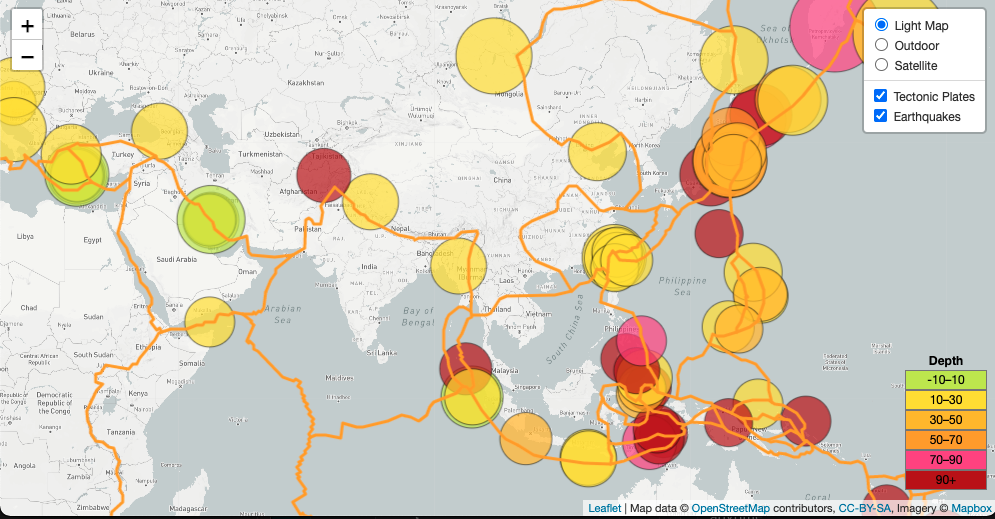
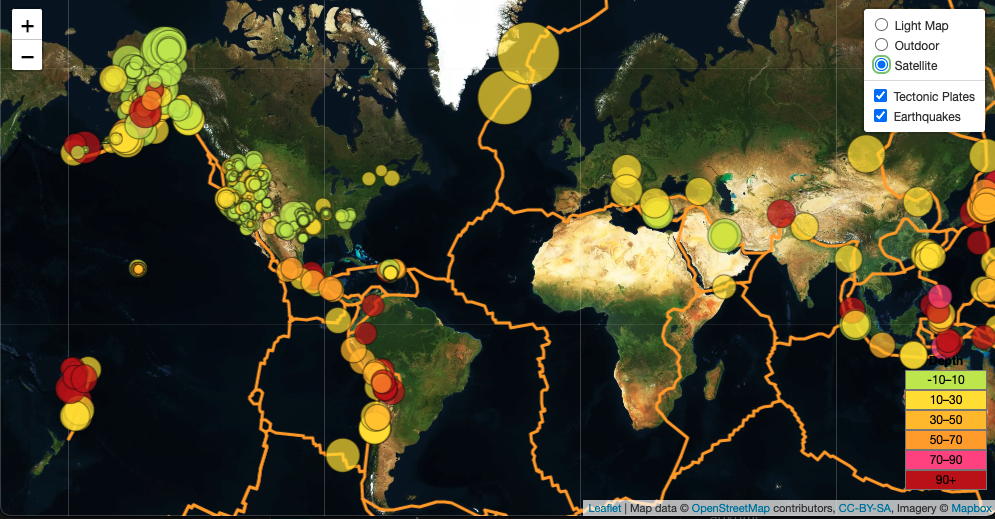

# leaflet-challenge

Using data from USGS about the earthquakes that occured in the past week, a map was created using `leaflet` to plot the earthquakes. The color of the marker represents the depth of the earthquake while the size of the marker represents the magnitude of the quake. A legend at the bottom provides information on the colorscale of the depth of the earthquakes. 

Included multiple base layers (light, outdoor and satellite) to choose from as well as overlays for the earthquake markers and tectonic plates. Also, each marker has a pop-up to include information about the quake (magnitude, depth and location).

This map is a great way to visualize that most earthquakes occur along the tectonic plates.

